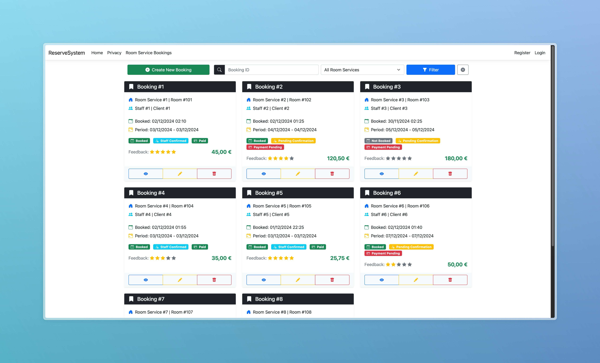
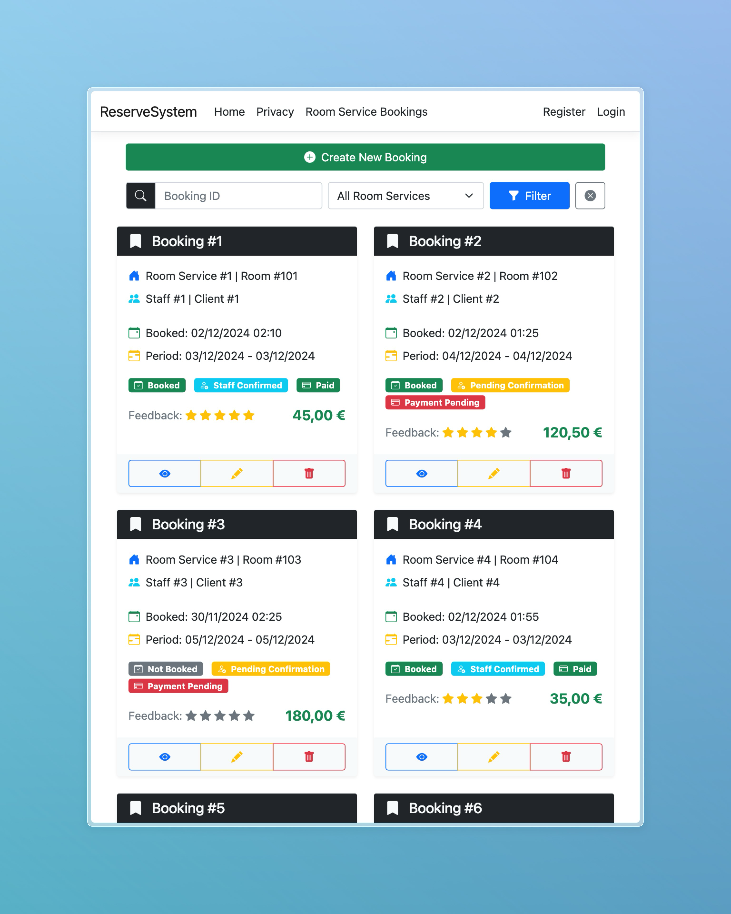
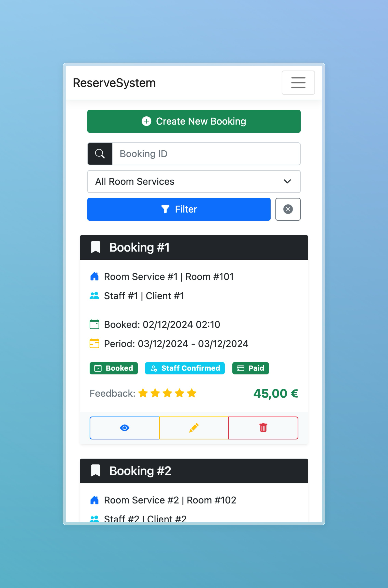

# Room Service Booking System

A responsive web application for managing hotel room service bookings built with ASP.NET Core MVC. This system allows hotel staff to manage room service requests, track bookings, and handle customer feedback efficiently.

## ✨ Features

- **Booking Management**
  - Create, view, edit and delete room service bookings
  - Confirmation workflow for all major actions
  - Success notifications after operations
  - Form validation with user-friendly feedback

- **Search & Filter**
  - Filter bookings by ID
  - Filter by room service type
  - Paginated results for better performance

- **User Experience**
  - Responsive design for all devices
  - Dark theme interface
  - Bootstrap icons for visual clarity
  - Real-time validation feedback
  - Intuitive navigation

## 🖼️ Screenshots

<details>
<summary>Click to expand screenshots</summary>

### Desktop View



### Tablet View



### Mobile View



</details>

## 🚀 Technologies

- **Backend**
  - ASP.NET Core 8.0 MVC
  - Entity Framework Core
  - SQLite Database

- **Frontend**
  - Bootstrap 5
  - Bootstrap Icons
  - jQuery
  - HTML5/CSS3

## 📦 Installation

### Prerequisites

- .NET 8.0 SDK
- Visual Studio 2022 or VS Code
- Git

### Setup Steps

```zsh
1. Clone the repository

--> git clone https://github.com/yourusername/ReserveSystem.git

2. Navigate to the project directory

--> cd ReserveSystem

3. Restore dependencies

--> dotnet restore

4. Run migrations to create the database

--> dotnet ef database update

5. Run the application

--> dotnet run
````

## 💾 Database Schema

RoomServiceBooking

| Column           | Type          | Description                    |
|------------------|---------------|--------------------------------|
| Id               | INT           | Primary Key, Auto-increment    |
| RoomServiceId    | INT(11)       | Foreign Key to RoomService     |
| StaffId          | INT(11)       | Foreign Key to Staff           |
| ClientId         | INT(11)       | Foreign Key to Client          |
| RoomId           | INT           | Room identifier                |
| DateTime         | DATETIME      | Booking creation timestamp     |
| StartDate        | DATE          | Service start date             |
| EndDate          | DATE          | Service end date               |
| BookedState      | BIT           | Booking status                 |
| StaffConfirmation| BIT           | Staff confirmation status      |
| ClientFeedback   | INT(1)        | Rating from 1-5                |
| ValueToPay       | DECIMAL(8,2)  | Service cost                   |
| PaymentDone      | BIT           | Payment status                 |

## 🏗️ Project Structure

```plaintext
ReserveSystem/
├── Controllers/
│   ├── HomeController.cs
│   └── RoomServiceBookingController.cs
├── Models/
│   ├── RoomServiceBooking.cs
│   └── ErrorViewModel.cs
├── Views/
│   ├── RoomServiceBooking/
│   │   ├── Index.cshtml
│   │   ├── Create.cshtml
│   │   ├── Edit.cshtml
│   │   ├── Details.cshtml
│   │   └── Delete.cshtml
│   └── Shared/
│       ├── Error.cshtml
│       ├── _Layout.cshtml
│       ├── ConfirmAction.cshtml
│       └── ActionSuccess.cshtml
└── wwwroot/
    ├── css/
    ├── js/
    └── lib/
````

## 👥 Team Group 3:

- Ana Antunes
- Marta Almeida
- Pedro Nunes
- Kerem
- Mehmet